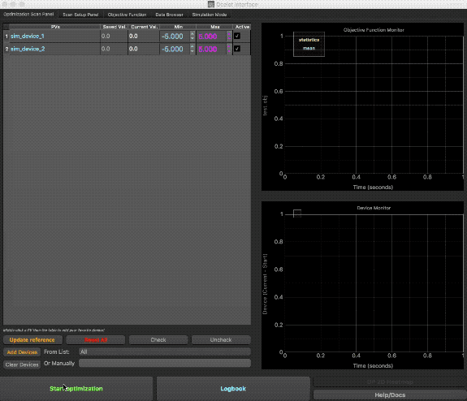

# An Introduction to Ocelot Optimizer

Ocelot optimizer is a platform for automated optimization of accelerator performance. 

It is an open source project and it is being developed by physicists from [The European XFEL](http://www.xfel.eu/), [DESY](http://www.desy.de/), [SLAC](https://www6.slac.stanford.edu). 

## Use cases 

The Optimizer is used for many different types of optimization. 

* **FEL facilities:**
 
    - FEL pulse energy maximization with:
        - Phase-shifters (EuXFEL)
        - Orbit in low energy sections (EuXFEL)
        - Matching quads (LCLS & EuXFEL)
        - RF settings (EuXFEL)
        - Launch orbit and orbit inside an undulator (EuXFEL)
    - Local dispersion correction (EuXFEL & FLASH)
    - HOM signal minimization in cavities (FLASH)
* **Storage rings (tests):**
    - Injection efficiency optimization (Kurchatov Institute)
    - Beam life time (test at BESSY-II)
    
## Ocelot schematic


From the beginning, Ocelot Optimizer was used by a few facilities (EuXFEL, LCLS, FLASH). To keep compatibility of the tool between them, an abstraction layer called Machine Interface was developed. The Machine Interface communicates with an accelerator control system and contains all machine related specifics. 
Algorithm API is designed to be a layer of abstraction between the Optimizer and an optimization methods.

#### Ocelot Optimizer includes:
* **Machine Interfaces:**
    - XFELMachineIterface
    - LCLSMachineInterface
    - FLASHMachineInterface
    - BESSYMachineInterface
    - MultinormalInterface (interface for algorithms testing)
* **Optimization Methods:**
    - [Simplex (Nelder–Mead method)](https://en.wikipedia.org/wiki/Nelder–Mead_method)
    - [Bayesian optimization w/ a GP](http://accelconf.web.cern.ch/accelconf/ipac2016/papers/wepow055.pdf)
    - [RCDS](https://www.slac.stanford.edu/pubs/slacpubs/15250/slac-pub-15414.pdf)
    - [Extremum Seeking](https://www.sciencedirect.com/science/article/pii/S0005109816300553)


## Graphical User Interface

Ocelot Optimizer was designed to cover as many as possible optimization problems especially during an accelerator commissioning. 
We tried to build GUI which reflects that goal. With GUI you can:
* Select different optimizers (Simplex, GP, ES, …)
* Select any group of devices
* Craft your objective function 
     - Simple PV
     - Do math on up to 5 PVs
     - Statistics: mean, stdev, quantiles
     - Write python script (loaded/edited via GUI)
     - Option to have simulated objective to test optimization methods
* Data browser - choose any point from the history of the last optimization
* Save predefined settings & routines




## How to get started

* Download @GitHub:  https://github.com/ocelot-collab/optimizer

* Try “simulation” interface and test different optimization methods: 
>> python generic_optim.py MultinormalInterface

* to ask help:
>> python generic_optim.py --help 

* Edit template machine interface to map in your control system:
     - [DemoInterface](mint/demo/demo_interface.py)
>> python generic_optim.py MultinormalInterface

```python
class DemoInterface(MachineInterface):
    name = 'DemoInterface'

    def __init__(self, args=None):
        super(DemoInterface, self).__init__(args=args)

        # self.config_dir is path to a directory where a default config will be saved (the tool state)
        # self.config_dir = "<optimizer>/parameters/" is default path in the parent class MachineInterface
        self.config_dir = os.path.join(self.config_dir, "demo")  # <optimizer>/parameters/demo

        # self.path2jsondir is a path to a folder where optimization histories will be saved in json format
        # by default self.path2jsondir = <data> on the same level that <optimizer>
        # the folder will be created automatically

        # flag from LCLSInterface which not allow Optimizer to write to control system
        self.read_only = False

    def get_value(self, channel):
        print("Called get_value for channel: {}.".format(channel))
        return random.random()

    def set_value(self, channel, val):
        print("Called set_value for channel: {}, with value: {}".format(channel, val))

```

As a second step we recommend to have a look to [XFELMachineInterface](mint/xfel/xfel_interface.py)
and also [TestMachineInterface](mint/xfel/xfel_interface.py) 
which you can run using:

>> python generic_optim.py --devmode 


See the parent class [MachineInterface](mint/opt_objects.py) to have more configurable options.  